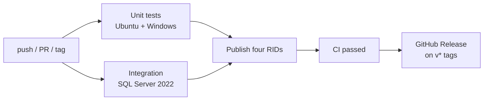

# ArtSync

> Developed by **[YOLOVibeCode](https://github.com/YOLOVibeCode)**, a subsidiary of **[Noctusoft](https://www.noctusoft.com)**.

[](https://github.com/YOLOVibeCode/art-sync-cli/actions/workflows/ci.yml)
[](LICENSE)

A free, open-source drop-in replacement for the Devart dbForge Schema Compare and Data Compare CLIs (`schemacompare.com`, `datacompare.com`, `dbforgesql.com`).

ArtSync accepts the same command-line grammar as Devart, emits the same exit codes, and performs **one-way** source→target schema and data synchronization — without a Devart license.

It is a drop-in for typical scheduled jobs. It is not a clone of dbForge Studio. Generated SQL and console wording are allowed to differ; **exit codes and end-state after `/sync`** are the contract.

| Check | Result |
|---|---|
| Live `/source` + `/target` + `/sync` | Yes |
| Unit tests | 228 (221 run locally; 7 skipped without extra setup) |
| Live integration tests | 28 against Docker SQL Server 2022 |
| Soak versus licensed Devart | Not run (needs a Devart license) |

---

## Why

Devart scheduled-job command lines look like this:

```text
schemacompare.com /schemacompare /source connection:"…" /target connection:"…" /sync
datacompare.com /datacompare /argfile:"D:\jobs\dc-prod.txt"
```

ArtSync replaces the executables. `.bat` files, Task Scheduler entries, and argfiles keep working unchanged.

---

## Drop-in contract

| Requirement | Status | Notes |
|---|---|---|
| Parse Devart argv the same way | Met | Non-POSIX grammar, `/argfile` (CLI wins), short/long names, boolean synonyms |
| Same kind of operation | Met | Compare / script / apply / report / log. Out-of-scope Studio ops exit 10 |
| Same numeric exit-code class | Met | 0, 10, 11, 40, 100, 101, 106, 107, 108, 112, 114. Never emits 20 (trial expired) |
| After `/sync`, target matches source in scope | Met for live databases | FK graphs, SQL types, unique keys, reports. Extra target objects are **not** dropped |
| Byte-identical T-SQL versus Devart | Not required | End state matters, not script text |

### What a scheduler can run unchanged

| Job shape | Drop-in? | Exit codes |
|---|---|---|
| `schemacompare /source … /target …` | Yes | 100 identical, 101 diffs, 108 none, 40 connect |
| `schemacompare … /sync` | Yes | 0 applied, 112 nothing to sync |
| `schemacompare … /sync:file.sql` | Yes | 101; target untouched |
| `datacompare /source … /target … /sync` | Yes | Same 100 / 101 / 0 / 112 / 108 / 40 pattern |
| `/argfile` + CLI override | Yes | CLI wins, matching Devart precedence |
| `/filter:.scflt` | Yes | 114 on bad XML |
| `/report` + `/reportformat HTML\|XML\|CSV` + `/log` | Yes | 107 report I/O, 106 log I/O; passwords redacted |
| `/q` | Yes | Stdout silent on success; errors still on stderr |

### Intentional non-parity

These are not bugs. They exit 10 or leave the target alone **by design**.

| Item | Behavior | Why |
|---|---|---|
| `/compfile` (`.scomp` / `.dcomp`) | Exit 10 | Do not invent project XML until a captured file is in `tests/fixtures/` |
| `backup:` / `snapshot:` / `scriptsfolder:` endpoints | Exit 10 | Live databases only in v1 |
| `/reportformat:XLS` | Exit 10 | Excel reports are out of scope |
| Extra tables only on the target | Left in place | DacFx `DropObjectsNotInSource` stays false — dropping extras by default is unsafe |
| Columnstore, memory-optimized, temporal history, `/fspath`, backups, `DropKeys` | Exit 10 if set | Listed as unsupported in v1 |
| Studio ops (`/dataexport`, `/script`, …) | Exit 10 | Out of scope |

### Remaining semantic gaps versus Devart

These parse without error but do not fully reproduce Devart internals. Typical same-name Azure sync jobs are unaffected.

| Area | Gap | Impact |
|---|---|---|
| Schema `IgnoreIndexes` | Only index options/padding, not excluding index objects | Jobs that ignore all indexes may still see index diffs |
| Schema `IgnoreIdentity` | No DacFx toggle for the IDENTITY property | IDENTITY-only diffs still flag |
| Schema `ExecuteAsSingleTransaction` | DacFx uses its own transaction model | Apply atomicity may differ |
| Script cosmetics | `IncludePrintComments` / `AddingErrorHandling` are no-ops | Script text differs (allowed) |
| `CheckIdentical` | Does not change the sync set | Reports list diffs; identical rows are not listed |
| `ToleranceInterval` | Exit 10 if explicitly set | Numeric-tolerance compare needs a different engine |
| Ctrl+Break → 2 | Not wired | Cancel is process-kill, not Devart exit 2 |
| Missing argfile → 105 | Returns 10 | Schedulers that distinguish 105 vs 10 would diverge |
| Soak versus Devart | Not run (needs a license) | Object/row sets proven on our fixtures, not proven identical to Devart on the same pair |

---

## Getting started

### Prerequisites

- [.NET 10 SDK](https://dotnet.microsoft.com/download)
- SQL Server 2016+ or Azure SQL Database / Managed Instance (for live compare/sync)

### Build and unit tests

```bash
dotnet test
```

Integration tests skip unless `ARTSYNC_INTEGRATION=true`.

### Live integration tests (Docker)

```bash
./scripts/run-integration-tests.sh
```

That starts SQL Server 2022, seeds `artsync_src` / `artsync_tgt`, and runs the schema + data suite (FK graphs, data types, reports, apply). See [tests/fixtures/README.md](tests/fixtures/README.md).

### Publish the three executable names

**Windows (PowerShell):**

```powershell
.\scripts\publish.ps1
# Output: publish\artsync-win-x64\schemacompare.exe
#                                   datacompare.exe
#                                   dbforgesql.exe
```

**Linux / macOS:**

```bash
./scripts/publish.sh linux-x64
# Output: publish/artsync-linux-x64/schemacompare
#                                    datacompare
#                                    dbforgesql
```

CI publishes `linux-x64`, `win-x64`, `osx-x64`, and `osx-arm64` on every green main build. Tag `v*` to cut a GitHub Release with those zips.

### Drop-in on Windows scheduler

Replace the Devart executable on `PATH`, or update the scheduled task program from `….com` to `….exe` of the same basename. Confirm the job uses live `/source` and `/target`, not `/compfile` or `backup:` endpoints.

Recommended first production cutover:

1. Compare-only — expect 100 or 101.
2. `/sync:file` — review the script; target stays untouched.
3. Live `/sync`.

---

## Usage

```text
# Schema compare only (exit 100 = identical, 101 = differences)
schemacompare.exe /source connection:"…" /target connection:"…"

# Schema apply
schemacompare.exe /source connection:"…" /target connection:"…" /sync

# Schema script to file
schemacompare.exe /source server:Srv1 database:db1 /target server:Srv2 database:db2 /sync:"C:\out.sql"

# Data compare with argfile
datacompare.exe /datacompare /argfile:"D:\jobs\dc-prod.txt"

# Schema compare with object filter
dbforgesql.exe /schemacompare /source connection:"…" /target connection:"…" /filter:"C:\filters\schema.scflt"
```

**Exit codes** match Devart. Run `/exitcodes` to print the table:

```text
schemacompare.exe /exitcodes
```

---

## CI/CD

Every pull request and push to `main` runs [.github/workflows/ci.yml](.github/workflows/ci.yml). Tag `v*` (for example `v1.0.0`) to cut a GitHub Release with the four published zips. Dependabot opens weekly PRs for NuGet and Actions.



| Job | What it proves |
|---|---|
| Unit tests on Ubuntu and Windows | Parser, exit codes, schema option map, hash payload, reports/logs |
| Integration against SQL Server 2022 | Live `/schemacompare` and `/datacompare` compare / script / apply |
| Publish drop-in CLIs | Self-contained `schemacompare`, `datacompare`, `dbforgesql` for `linux-x64`, `win-x64`, `osx-x64`, `osx-arm64`; Linux binaries smoke-tested (`/exitcodes`, `/?`) |
| `CI passed` | Single required check for branch protection — fails if any of the jobs above failed or were skipped |
| GitHub Release | On tags `v*`, attaches the four zip artifacts |

---

## Architecture

```
ArtSync.Abstractions   Small interfaces + CommandRequest records
ArtSync.Compat         Devart argv tokenizer, argfile, redaction
ArtSync.Cli            argv[0] dispatch, help, exit codes
ArtSync.Schema         DacFx schema engine behind ISchemaCompare
ArtSync.Data           Hash-stream data engine behind IDataCompare
ArtSync.Reporting      HTML / CSV / XML report writers + `/log`
```

All engine code sits behind thin interfaces. `ArtSync.Cli` depends only on `IArgvParser` and `IOperationHandler` — it never imports DacFx or SqlClient directly.

---

## Compatibility

| Feature | Status |
|---|---|
| `/schemacompare` compare + script + apply | Complete |
| `/datacompare` compare + script + apply | Complete |
| `/source connection:"…"` | Complete |
| `/source server:… database:… user:… password:…` | Complete |
| `/argfile` | Complete |
| `/filter:<.scflt>` (schema) | Complete |
| `/sync` / `/sync:<file>` | Complete |
| `/report` + `/reportformat:HTML\|XML\|CSV` | Complete (XLS → exit 10) |
| `/log` | Complete (passwords redacted) |
| `/compfile` (`.scomp` / `.dcomp`) | Exit 10 until a real file is in `tests/fixtures/` |
| `/source backup:…` | Exit 10 — out of scope in v1 |
| Extra objects on the target (schema drop) | Not dropped (`DropObjectsNotInSource` stays false) |
| Azure SQL Database | Supported |
| Azure SQL Managed Instance | Supported |
| SQL Server 2016+ | Supported |

---

## Licenses

- **ArtSync source** — [MIT](LICENSE)
- **Microsoft.SqlServer.DacFx** — Microsoft EULA (free to use, not OSS). Included as a NuGet dependency.
- **Microsoft.Data.SqlClient** — MIT

---

## About

ArtSync is a project by **YOLOVibeCode**, a subsidiary of **[Noctusoft](https://www.noctusoft.com)**.

---

## Contributing

Issues and PRs welcome. Please open an issue before large changes to align on scope — this tool intentionally does **not** aim to clone all of dbForge Studio, only the compare/sync command lines.
